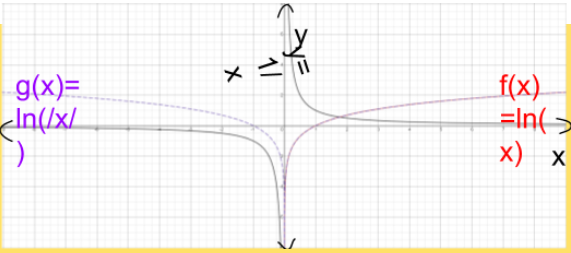

You have already spent a lot of your mathematical lives talking about functions. The basic idea is when you are given a valid input into a function, so the member of the function's domain, the function is going to tell what is going to be the corresponding output $f(x)$.

What we are going to do is explore a new way for you of defining a function. And that is by using a definite integral, but it's the same general idea.

This is another way of representing what outputs you might get for a given input. But I'm now going to define a new function based on a definite integral.

$$g(x) = \int_{-2}^{x} f(t)dt$$

This might look fancy, but what's happening here is, given an input $x$, $g(x)$ is going to be based on what the definite integral here would be for that $x$.

| $x$ | $g(x)$                             |
| --- | ---------------------------------- |
| $1$ | $g(1) = \int_{-2}^{1} f(t)dt = 16$ |
| $2$ | $g(2) = \int_{-2}^{2} f(t)dt = 21$ |

We just counted the squares in the graph. This should help you understand what an integral is.

Let's say that we have the function

$$g(x) = \int_{19}^{x} \sqrt[3]{t} dt$$

And I'm curious about finding what is $g'(27)$? What is that equal to?

We could try to figure out $g'(x)$, and then evaluate it for 27, and the best way that I can think about doing that is by taking the derivative of both sides

$$\frac{d}{dx} \left[ g(x) \right] = \frac{d}{dx} \left[ \int_{19}^{x} \sqrt[3]{t}dt \right]$$

Now the left side is pretty straight forward. The derivative with respect to $x$ of $g(x)$, it's just going to be $g'(x)$, but what is the right hand side going to be equal to? Well that's where the second fundamental theorem of calculus is useful.

Well, no matter what $x$ is, $\sqrt[3]{t}$ is going to be continuous over that interval, and so then we can just say that the derivative of all of this ($\int_{19}^{x} $\sqrt[3]{t}dt$) is just going to be $\sqrt[3]{t}$ replacing $t$ with $x$. So we are going to get the $\sqrt[3]{x}$. And so we can go to ou original question, what is $g'(27)\$ going to be equal to?

$$g'(27) = \sqrt[3]{27} = 3$$

What is g'(27) when $g(x) = \int_{19}^{x} \sqrt[3]{t} dt$?

We can take the derivative of both sides

$$\frac{d}{dx}\left[ g(x) \right] = \frac{d}{dx}\left[ \int_{19}^{x} \sqrt[3]{t}dt \right]$$

Let's say we have

$$F(x) = \int_{1}^{\sin x} (2t - 1)dt$$

and what we are curious about is trying to figure out what is $F'(x)$ going to be equal to?

So some of you might have been a little bit challenged by this notion of that instead of an $x$ on this upper bound, I now have $\sin(x)$. If it was just an $x$ I could have used the fundamental theorem of calculus.

- [ ] LINK_2ND_THEOREM

Just to review that if I had a function

$$h(x) = \int_{1}^{x} (2t - 1)dt,$$

we know from the fundamental theorem of calculus that $h'(x)$ would be simply this inner function $(2t-1)$ with $t$ replaced by $x$. It would just be $2x-1$, pretty straightforward.

But our example isn't quite as straightforward. Instead of having $x$ up there, our upper bound is $sin(x)$. So one way to think about it is if we were to define $g(x) = sin(x)$, instead of an $x$, everywhere we see an $x$, we are replacing it with a $sin(x)$. So,

$$F(x) = h(g(x))$$

Now why am I doing all of that? Well, this might start making you think about the chain rule. Because if the expression above is true, then that means that

$$F'(x) = h'(g(x)) \cdot g'(x)$$

And so what would that be? Well we already know what $h'(x)$ is. So

$$h'(g(x)) = 2(sin(x))-1$$

And then what's $g'(x)$? $g'(x)$ is just the derivative of $sin(x)$, which is $cos(x)$

$$F'(x) = (2sin(x)-1) \cdot cos(x)$$

### How computers calculate integrals

- [ ] Написать если будет время

### Time

Let's just think about velocity vs. time graphs. So horizontal axis is time $t$ in seconds and vertical axis velocity $v$ is m/s. So let's say that I have a first velocity time graph (straight line)

$$v_{1}(t) = 3$$

And if we're to look at the definite integral

$$\int_{1}^{5} v_{1}(t)dt$$

time goes from 1s to 5s.

What would this equal to? Well here my function is above my $t$ axis. So i'll just go from 1 to 5. And I could just think about the area there, and this area is pretty easy to calculate

$$4 \cdot 3 = \int_{1}^{5} v_{1}(t) dt = 12$$

And one way to conceptualize this is that this gives us our change in position. If my velocity is 3m/s and since it's positive you can conceptualize that as it's going to the right at 3 m/s.

What is my change in position? Well I would have gone 12m to the right. And you don't need calculus to figure that out. But what if it were the other way around? What if I had another velocity function, let's call that

$$v_{2}(t) = - 2$$

So what should $\int_{1}^{5} v_{2}(t)dt$ be equal to?

Well, it should be equal to my change in position. But if my velocity is negative that means I'm moving to the left. That means my change in position should be to the left, as opposed to the right.

So we can just look at the area. When if you just look at it as a rectangle, it's going to be

$$2 \cdot 4 = 8$$

But you have to be very careful. Since it's below my horizontal axis and above my function, 8 is going to be negative. And this should make a lot of sense. If I'm going 2m/s to the left for 4s, or another way to think about it, if I'm going negative 2m/s for 4s, then my change in position is going to be

$$-8 (-2 \cdot 4 = -8)$$

#### Indefinite (hard example)

