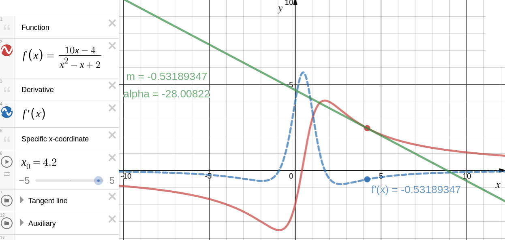
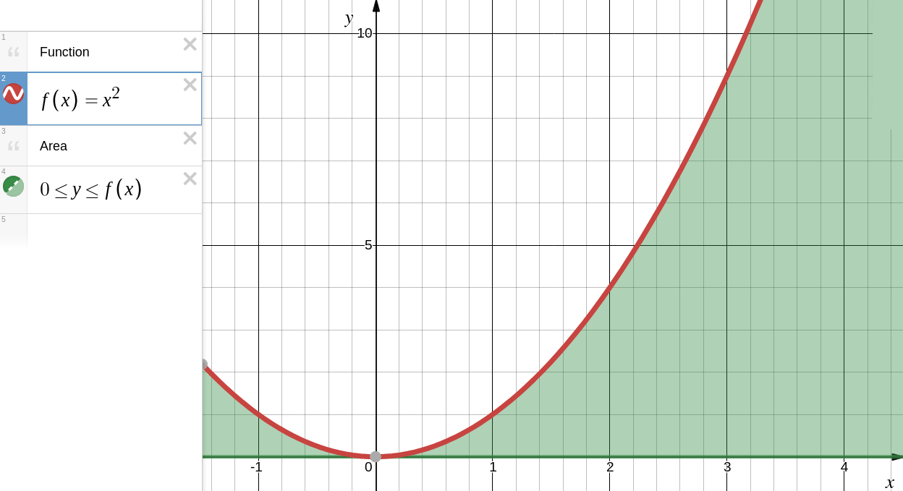
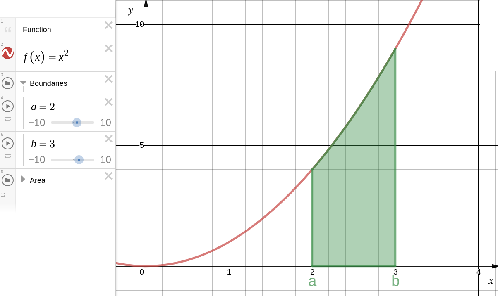
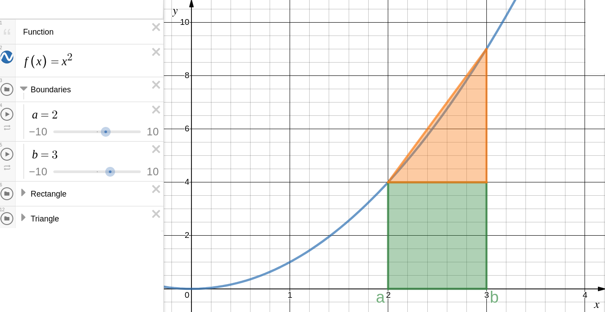
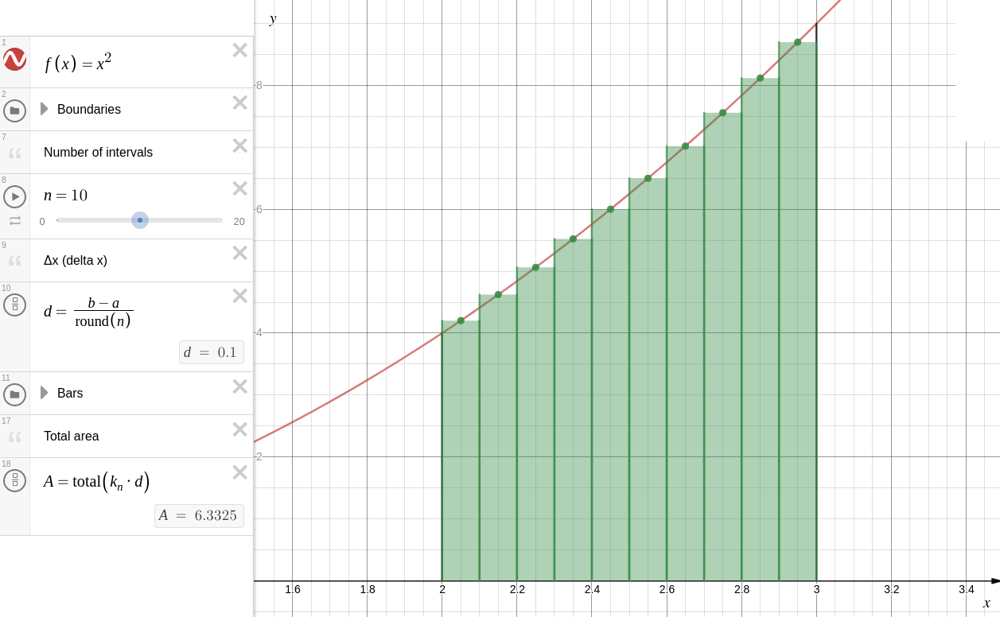
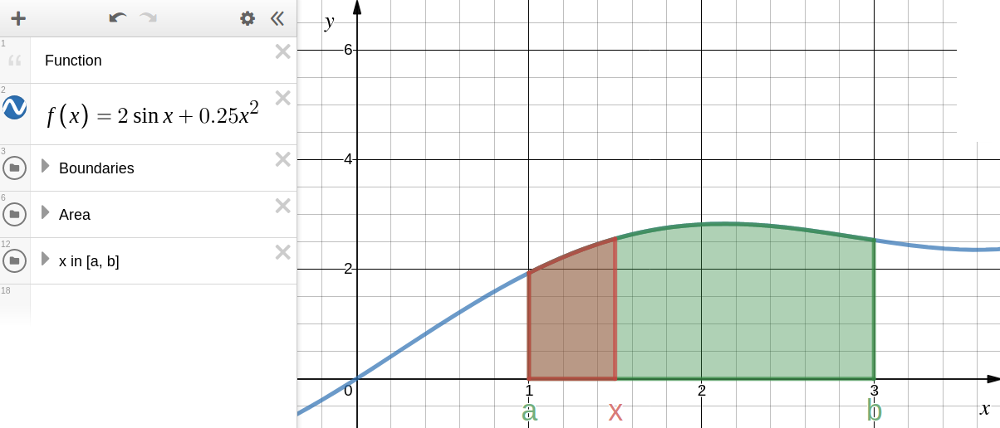
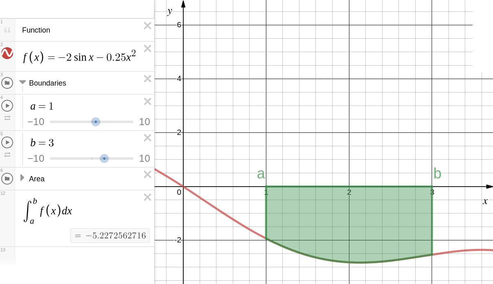
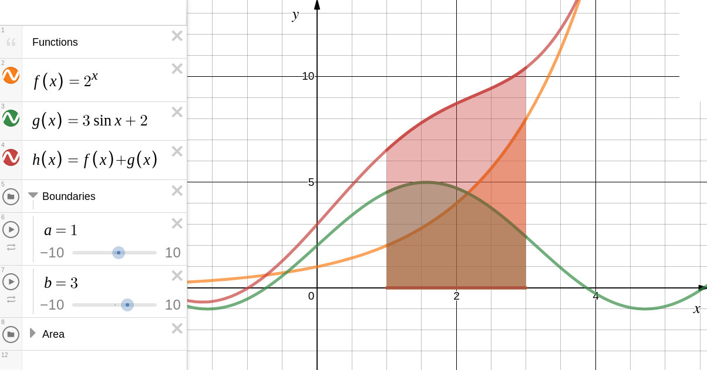
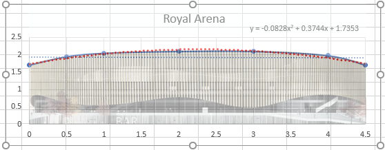
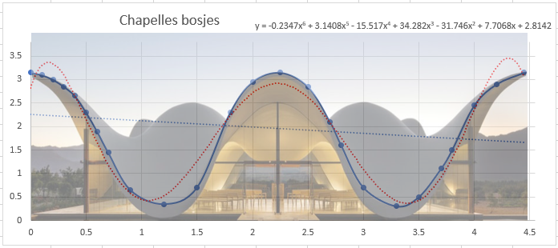

# Integrals and architecture

- [ ] Формулы должны нумероваться
- [ ] Проверить ссылочную целостность

## Intro

Выйдите на улицу и оглянитесь. Что Вы видите? Скорее всего вы окружены какими-то постройками, другими словами архитектурой (если Вы не вышли на природу, конечно же).

А что такое архитектура? Архитектура происходит от греческого слова architekthon и оно значит искусство проектировать и строить здания и другие сооружения, необходимые людям для их жизни и их деятельности.

Для проектирования этих зданий, нужны хорошие знания в математике и физике, для безопасности, для красоты и для ещё очень многих причин. Но мы остановимся на математических исчислениях в архитектуре, а точнее на интегралах.

Но, что такое математическое исчисление?

Исчисление -- это ветка в математике которая включает в себя изучение скорости изменения. Перед тем как исчисления были придуманы вся математика была статической, то есть она могла только посчитать предметы которые не двигались. Но вселенная в бесконечном движении.

Поэтому были придуманы исчисления. Я выбрала эту интересную тему потому, что во первых мне было очень интересно исследовать исчисления, а во вторых я хочу посвятить свою жизнь архитектуре и я считаю если я познакомлюсь с этой профессией сейчас, то потом будет легче. В следующих параграфах я попытаюсь объяснить, что такое интегралы, как они связаны с архитектурой и решу задачу для примера.

## Theoretical part

### Prerequisites

- [ ] Рассказать про интерес в нахождении скорости изменения функции
- [ ] Рассказать про интерес нахождения площади криволинейных фигур

- [ ] Немного Уменьшить объем исторической справки

The first known method for calculating the integrals is the method for studying the area or volume of curvilinear figures - the method of exhausting Eudoxus (Eudoxus of Cnidus (c. 408 BC - c. 355 BC) - ancient Greek mathematician, mechanic and astronomer), which was proposed around 370 BC. e. The essence of this method is as follows: the figure, the area or volume of which they tried to find, was divided into an infinite number of parts for which the area or volume is already known. This method was further developed in the works of the ancient Greek mathematician, physicist and engineer Archimedes (287 BC - 212 BC) for calculating the area of ​​parabolas and the approximate calculation of the area of ​​a circle. Similar methods were developed in China in the third century by the Chinese mathematician Liu Hui (220 - 280), who used them to find the area of ​​a circle. To find the volume of the ball, this method was used by the Chinese mathematician, astronomer, mechanic, writer Zu Chunzhi (429-500) with his son, also a mathematician and astronomer, the ruler of the region and the state treasurer, Zu Geng.

Further, a big step forward in the development of integral calculus was undertaken in the 11th century in Iraq by the Arab universal scientist, mathematician, mechanic, physicist and astronomer Abu Ali al-Hasan ibn al-Hasan ibn al-Hayesam al-Basri (965-1039) (or Ibn al-Khaysam, in Europe known as Alhazen), who in his work \"On the measurement of a parabolic body\" gives formulas for the sum of consecutive squares, cubes and fourth degrees, and a number of other formulas for the sums of series.

Using mathematical induction, he was able to generalize his results for integrals from polynomials to the fourth degree. Thus, he was close to finding a general formula for integrals of polynomials not higher than the fourth degree.

The next significant impetus in calculus of integrals took place only in the 16th century in the works of the Italian mathematician Bonaventure Francesco Cavalieri (1598 - 1647), which described his method of indivisibility, as well as in the works of the French mathematician Pierre de Fermat (1601 - 1665). These scientists laid the foundations of modern integral calculus. Further development is associated with the activities of the English mathematician, physicist and theologian Isaac Barrow (1630 - 1677) and the Italian mathematician and physicist, a student of Galileo Evangelista Torricelli (1608 - 1647), who presented the first hints of the connection between integration and differentiation.

During the formation of the integral calculus, the designation of the integral also changed. The English physicist, mechanic, mathematician, and astronomer Isaac Newton (1643 - 1727) used, though not in all his works, as an integration symbol, the square icon in front of or around the function designation, as well as the vertical bar over the function, but these designations did not receive wide distribution. The modern designation of the indefinite integral was introduced by the German philosopher, logician, mathematician, mechanic, physicist, lawyer, historian, diplomat, inventor and linguist Gottfried Wilhelm Leibniz (1646 - 1716) in 1675. He formed the symbol of the integral from the letter \"long s\" (from the first letter of the word Summa - the sum) The modern designation of a certain integral, indicating the limits of integration, was first proposed by the French mathematician and physicist Jean Baptiste Joseph Fourier (1768 - 1830) in 1819-20 . The term \"integral\" was coined by the Swiss mathematician Jacob Bernoulli (1654 - 1705) in 1690.[^1]

- [ ] Привести пример вычисления площади круга

Оказывается, задачи нахождения скорости изменения функций и нахождения площадей под кривыми тесно связаны друг с другом. Позже мы увидим, что эти операции дополняют друг друга как действия сложения и вычитания, умножения и деления, the operations of squaring and extracting the square root.

If we square a positive number and then take the positive square root, then again we get the original number. Similarly, if we take the integral of some continuous function $f$, we get a new function whose derivative gives us again the original function $f$.[^3]

### What is derivative

- [ ] Подробнее хотелось бы по возможности

The derivative of a function is the concept of differential calculus, which characterizes the rate of change of a function at a given point.

It is defined as the limit of the ratio of the increment of the function to the increment of its argument when the argument tends to increment the argument to zero, if such a limit exists.

$$f'(a) = \lim_{\Delta x \rightarrow 0} \frac{f(a + \Delta x) - f(a)}{\Delta x}$$

A function having a finite derivative (at some point) is called differentiable (at a given point). The process of calculating the derivative is called differentiation. The reverse process - finding the antiderivative is called integration.[^2]

Technically a derivative is the slope of the tangent of a function at a given point

$$m = f'(a)$$

The integral itself is the reverse of a derivative. We will discuss it in

- [ ] LINK

### Introduction to integrals

- [ ] Подвести к вычислению площадей

Когда мы говорим про площадь под графиком, то мы имеем ввиду часть координатной плоскости, ограниченной $x$-axis and graph itself. For example, the area of quadratic function $f(x) = x^2$ будет выглядеть следующим образом

Для простоты ограничим искомую площадь двумя границами, let's say between $x = а$ and $x = b$ (left and right boundaries).

Как же найти эту площадь? Первое, что приходит в голову - решить задачу геометрически. В качестве первого приближения можно считать участок кривой от 2 до 3 прямой линией. Тогда площадь под кривой может быть найдена как сумма площадей прямоугольника и треугольника

Площадь прямоугольного кусочка

$$A = bh$$

where $A$ -- area of the rectangle, $b$ -- rectangle's base, $h$ -- rectangle's height.

$A_{rect} = (3 - 2) \cdot 4 = 4$

Площадь треугольного кусочка

$$A = \frac{bh}{2}$$

where $b$ -- triangle's base, $h$ -- triangle's height.

$A_{tr} = \dfrac{(3 - 2) \cdot (9 - 4)}{2} = 2.5$

Общая площадь фигуры

$A = A_{rect} + A_{tr} = 4 + 2.5 = 6.5$

Мы получили приближенное значение искомой площади. Но так как верхняя линия не является прямой линией, то в нашем значении есть погрешность. И по мере возрастания нелинейности кривой, точность решения будет падать.

Метод интегрирования предлагает другой подход, который позволяет добиться better approximations for the area. How would we do it? Well you can divide this section into а bunch of $\Delta x$'s that go from $а$ to $b$. They could be equal sections or not, but let\'s just say equal sections.

If we have $n$ intervals, $\Delta x$ can be found this way

$$\Delta x = \frac{b - a}{n}$$

And so what could we do is, let's try to sum up the area of the rectangles. And we could make the height based on the values of the function on the right bound. It doesn't have to be. It could be the value of the function someplace in the $\Delta x$.

And so now we have an approximation where we could say, the area of one rectangle is going to be $d(x)$, right boundary, times $\Delta x$

|     | $x$-coordinate | Height | Area                   |
| --- | -------------- | ------ | ---------------------- |
| 1   | 2.05           | 4.2025 | 0.1 · 4.2025 = 0.42025 |
| 2   | 2.15           | 4.6225 | 0.1 · 4.6225 = 0.46225 |
| 3   | 2.25           | 5.0625 | 0.1 · 5.0625 = 0.50625 |
| 4   | 2.35           | 5.5225 | 0.1 · 5.5225 = 0.55225 |
| 5   | 2.45           | 6.0025 | 0.1 · 6.0025 = 0.60025 |
| 6   | 2.55           | 6.5025 | 0.1 · 6.5025 = 0.65025 |
| 7   | 2.65           | 7.0225 | 0.1 · 7.0225 = 0.70225 |
| 8   | 2.75           | 7.5625 | 0.1 · 7.5625 = 0.75625 |
| 9   | 2.85           | 8.1225 | 0.1 · 8.1225 = 0.81225 |
| 10  | 2.95           | 8.7025 | 0.1 · 8.7025 = 0.87025 |

Now we can sum the areas of the rectangles to find the approximate area under the curve:

Area under the curve is

A = 0.42025 + 0.46225 + 0.50625 + 0.55225 + 0.60025 + 0.65025 + 0.70225 + 0.75625 + 0.81225 + 0.87025 = **6.3325**

But as long as we use a finite number, we might say that we can always get better by making our $\Delta x$'s smaller and then by having more of these rectangles. The problem is that as we can see in the first graph, there is a lot of spaces under the curve left, that we did not count in the area.

So what we can do is to make $\Delta x$ thinner and thinner, and $n$ (number of rectangles) larger and largerб as $\Delta x$ gets infinitesimally small and $n$ approaches infinity.

As we can see in graph 2 the spaces between the graph and the rectangles are becoming smaller, and we can try to calculate the area under the same graph, but with smaller $\Delta x$

|     | $x$-coordinate | Height  | Area                     |
| --- | -------------- | ------- | ------------------------ |
| 1   | 2.025          | 4.10062 | 0.05 · 4.10062 = 0.20503 |
| 2   | 2.075          | 4.30563 | 0.05 · 4.30563 = 0.21528 |
| 3   | 2.125          | 4.51562 | 0.05 · 4.51562 = 0.22578 |
| 4   | 2.175          | 4.73062 | 0.05 · 4.73062 = 0.23653 |
| 5   | 2.225          | 4.95063 | 0.05 · 4.95063 = 0.24753 |
| 6   | 2.275          | 5.17562 | 0.05 · 5.17562 = 0.25878 |
| 7   | 2.325          | 5.40563 | 0.05 · 5.40563 = 0.27028 |
| 8   | 2.375          | 5.64062 | 0.05 · 5.64062 = 0.28203 |
| 9   | 2.425          | 5.88062 | 0.05 · 5.88062 = 0.29403 |
| 10  | 2.475          | 6.12563 | 0.05 · 6.12563 = 0.30628 |
| 11  | 2.525          | 6.37562 | 0.05 · 6.37562 = 0.31878 |
| 12  | 2.575          | 6.63063 | 0.05 · 6.63063 = 0.33153 |
| 13  | 2.625          | 6.89062 | 0.05 · 6.89062 = 0.34453 |
| 14  | 2.675          | 7.15562 | 0.05 · 7.15562 = 0.35778 |
| 15  | 2.725          | 7.42563 | 0.05 · 7.42563 = 0.37128 |
| 16  | 2.775          | 7.70062 | 0.05 · 7.70062 = 0.38503 |
| 17  | 2.825          | 7.98063 | 0.05 · 7.98063 = 0.39903 |
| 18  | 2.875          | 8.26562 | 0.05 · 8.26562 = 0.41328 |
| 19  | 2.925          | 8.55562 | 0.05 · 8.55562 = 0.42778 |
| 20  | 2.975          | 8.85063 | 0.05 · 8.85063 = 0.44253 |

Now we can add up the areas of the rectangles to find out the approximate area under the curve

A = 0.20503 + 0.21528 + 0.22578 + 0.23653 + 0.24753 + 0.25878 + 0.27028 + 0.28203 + 0.29403 + 0.30628 + 0.31878 + 0.33153 + 0.34453 + 0.35778 + 0.37128 + 0.38503 + 0.39903 + 0.41328 + 0.42778 + 0.44253 = **6.3331**

We can conclude that if we make the $\Delta x$'s smaller, there is going to be less and less of space left between the graph and the rectangles, which leads to a better approximation of the area under the curve.

And so you are probably sensing something, that maybe we could think about the limit as $n$ approaches infinity or the limit as $\Delta x$ becomes very small. And this notion of getting better and better approximations, as we take the limit as $n$ approaches infinity

$$\lim_{n \rightarrow \infty} \left( f(x_{i}) \cdot \Delta x_{i} \right) = \int f(x)dx$$

Where

$n$ -- number of rectangles,

$f(x)$ -- the function,

$\Delta x$ -- the space base of the rectangles

$$\Delta x = \frac{b - a}{n}$$

This is the core idea of integral calculus. And it's called integral calculus because the central operation we use, the summing up of an infinite number of infinitesimally thin things, is the integral.

But you can already see the parallels here. You can view the integral sign as a sigma notation, as a summation sign, but instead of taking the sum of a discrete number of things, you are taking the sum of an infinitely thin things.

Instead of $\Delta x$, you now have $dx$, infinitesimally small things. As we will see in the fundamental theorem of calculus, that integration, the notion of integral, is tied closely to the notion of a derivative, in fact, the notion of an antiderivative.

### The fundamental theorem of calculus

#### First part

Let's say I have some function $f$ that is continuous on an interval between $a$ and $b$. Let's make the horizontal axis as $t$ and the vertical axis as $y$.

Graph $y = f(t)$. Our upper boundary is $b$, so lower boundary $a$. Let's just define some new function that is the area under the curve, between $a$ and some point that's in our interval, for example $x$.

Well, how do we denote the area under the curve between two endpoints? Well, we just use our definite integral, it really just represents the area under the curve between two endpoints

$$\int_a^x f(t) dt$$

Now this right here, is going to be a function of $x$, where $x$ is in the interval between $a$ and $b$.

The function $\int_a^x f(t) dt$ is going to be another function of $x$. This value is going to depend on what $x$ we actually choose. So I'm going to say that this is equal to $F(x)$. If you give me an $x$ value that's between $a$ and $b$, it'll tell you the area under $f(t)$ and between $a$ and $x$. So, for example

$$F(x) = \int_{a}^{x} f(t)dt$$

The fundamental theorem of calculus tells us that if $f$ is continuous real-valued function defined on on a closed interval $[a, b]$, then $F(x)$ is differentiable at every possible $x$ between $a$ and $b$. If we were to take the derivative of our $F(x)$, which is going to be the same thing as taking the derivative of $\int_a^x f(t) dt$, they are going to be the same thing

$$F'(x) = \frac{d}{dx} \int_a^x f(t) dt = f(x)$$

So let me make it clear. Every continuous $f$, has an antiderivative $F(x)$. When you are taking the definite integral, one way of thinking, especially if you are taking a definite integral between $a$ and $x$, is that you are essentially taking an antiderivative.

#### Second part

Now what I want to do is connect the first fundamental theorem of calculus to the second part, which we tend to use to actually evaluate definite integrals.

So let's think about what $F(b) - F(a)$. $F(b)$ is literally just replacing the $b$ where you see the $x$

$$\int_{c}^{b} f(t)dt - \int_{c}^{a} f(t)dt$$

So if you subtract the first area out of the second one, what are you left with? Well we are left with $\int_{a}^{b} f(x)dx$. This right over here is the second fundamental theorem of calculus.

$$F(b) - F(a) = \int_{c}^{b} f(t)dt - \int_{c}^{a} f(t)dt = \int_{a}^{b} f(x)dx$$

It tells us that if $f$ is continuous on the interval that this $\int_{a}^{b} f(x)dx$ is going to be equal to the antiderivative of $f$. And we see that $F$ is the antiderivative of $f$.

The subtraction tells you, if you have a definite integral like this, it\'s completely equivalent to an antiderivative of it, evaluated at $b$, and from that you subtract it evaluated at $a$. So it's the second fundamental theorem of calculus. This is actually how you evaluate definite integral.

Now we see a connection between differential calculus and integral calculus, or, in other words, connection between derivatives, or maybe I should say the antiderivatives and integration. This is why it's called the fundamental theorem of calculus, which before this, we just viewed integration as area under the curve.

### Basic rules of integration

В этом разделе мы рассмотрим полезные свойства интегралов, которые могут значительно упростить процесс вычисления интегралов

#### Zero area

Let's do something interesting. Let's think about $\int_{a}^{b} f(x)dx$, it's the area under the curve $f(x)$, but instead of it being mean between two different $x$ values, say $a$ and $b$, like we saw it a multiple of times, let's say it's between the same one.

Let's say it's between $c$ and $c$. What do you think this formula is going to be equal to? What does this represent, what is this equal to? If you try to visualize it, you're thinking, well the area under the curve $f(x)$, above the $x$ axis, from $x = c$ and $x = c$.

So this region, as we can call it, that we think about it does have a height. The height is $f(x)$. What's the width? Well, there is no width, we're just at a single point. We're not going from $c$ to $c$ plus some other $\Delta x$. We're thinking about area, we're thinking about how much two-dimensional space you're taking up.

But this idea, it is just a one-dimensional one, I think you could think of it as a line segment. What's the area of a line segment? Well a line segment has no area. So the formula is going to be equal to 0.

Now you might say, I get that. I see why that could make sense, why that makes intuitive sense. I'm trying to find the area of a rectangle where I know it's height, but it's width is 0. So that area is going to be 0, it's one way to think about it.

But why am I even pointing this out to you? When we do more complexe definite integration problems and solving things sometimes recognizing this will help you simplify an integration problem dramatically.

#### Signs

We've already thought about what a definite integral means. If I'm taking the definite integral from $a$ to $b$

$$\int_a^b f(x) dx$$

I can just view that as the area below my function $f$. But what if my function was not above the $x$ axis? What if it were below the $x$ axis?

If I asked you what is $\int_a^b g(x)dx$? Well you might be tempted to say that it's just the area again between my curve and the $x$ axis. You might be tempted to say that this is just going to be 5.

But you have to be very careful. Because if you're looking at the area above your curve and below your $x$ axis vs. below your curve and above the $x$ axis, this $\int_a^b g(x)dx$ is actually going to be the negative of the area (-5).

So the big takeaway is, if it's below your function and above the horizontal axis the and your $a$ is less than $b$, then your definite integral is going to be positive. If your $a$ is less than $b$, but your function is below the horizontal axis, then your definite integral is going to be negative.

#### Addition

Imagine we have two functions, $y = f(x)$ and $y = g(x)$. And we know ways to represent the area under the curve between two points $x = a$ and $x = b$, we can write the area for the first graph as

$$\int_{a}^{b} f(x)dx$$

And we can do the same thing for the second curve

$$\int_{a}^{b} g(x)dx$$

Now given these two things, let's actually think about the area under the curve of the function created by the sum of these two functions.

I want to do is to graph $y = f(x)+g(x)$. So for any given $x$, it's going to be $f(x)$ and then I'm going to add the $g(x)$ to it. So what will that look like?

Now an interesting question is, what would be the area under the curve $f(x)+g(x)$? We know it can be represented as $\int_{a}^{b} (f(x) + g(x))dx$. Now the question is, how does it relate to the area of the first 2 graphs?

Well the important thing to realize is that the first area is going to be the first part of our last graph's area. That one is pretty clear. But how does the area of the second graph relate to the third graph?

And to think about that, we just have to think about what does the integral mean? What does it represent? We've already thought about these really small rectangles. And we're taking the sum of limit of infinite number of these infinitely thin rectangles. We're thinking about how we have some change in $x$, and then you multiply it by the height which is going to be the value of the function of that point.

So the difference of the heights between the first and the third graphs are going to be the height of the second graph. And so the area of the second graph is the exact same thing as the area between the first and the third graphs. So the area under the curve $\int_{a}^{b} (f(x) + g(x))dx$ is just going to be the sum of the two first definite integrals.

But when is this actually useful? Well, as you later will learn to evaluate these integrals, you'll see the most powerful idea is being able to decompose them this way.

$$\int_{a}^{b} f(x)dx + \int_{a}^{b} g(x)dx = \int_{a}^{b} (f(x) + g(x))dx$$

#### Multiplication

I want to start thinking about the area under the curve that's a scaled version of $f(x)$. Let's say it's

$$y = c \cdot f(x)$$

And so I want this to be kind of some arbitrary number, but just to help me visualize let's just pretend $c = 3$, just for visualization purposes.

- [ ] IMAGE HERE

Now what do we think the area under this curve is going to be between $a$ and $b$? Now we already know how we can denote it. That area right over there is equal to

$$\int_{a}^{b} c \cdot f(x) dx$$

I guess to make the question a little bit clearer, how does this relate $\int_{a}^{b} cf(x)dx$ to this $\int_{a}^{b} f(x)dx$? Well, one way to think about it, is that we just scaled the vertical dimension up by $c$, so one way that you could reason it, is if I'm finding the area of a rectangle and I have the vertical dimension $h$ and the horizontal dimension $l$.

We know the area is going to be $h \cdot l$. Now if I scale up the vertical dimension by $c$, so instead of $h$ it's $c \cdot h$, the width is beta. What's the area going to be

Well, it's going to be $c \cdot h \cdot l$, or another way to think of it, when I scale one of the dimensions by $c$, I take my old area and I scale it up by $c$. And that's what we're doing, we're scaling up the vertical dimension by $c$.

When you multiply $c \cdot f(x)$, $f(x)$ is giving us the vertical height. If you scale one dimension by $c$ you're gonna scale that area by $c$.

$$\int_{a}^{b} c \cdot f(x) dx = c \int_{a}^{b} f(x)dx$$

If you scale up the function, you're essentially scaling up the vertical dimension, so the area under $\int_{a}^{b} cf(x)dx$ is going to be just a scaled up version of the area under the original function $f(x)$. And is going to be a really useful property of definite integrals that's going to help us solve a bunch of definite integrals.

#### Swapped boundaries

We've already seen the definition of the definite integral, so it's the area under a graph, and we can approximate it by splitting it into $n$ rectangles. We are gonna imagine that they all have the same width and each of those widths are $\Delta x$

Given the definition

- [ ] LINK_HERE

, how do you think $\int_{a}^{b} f(x)dx$ is related to $\int_{b}^{a} f(x)dx$?

Well, let's just think about what's going to happen. $\Delta x$ is going to be

$$\Delta x = \frac{a - b}{n}$$

In other words, this $\Delta x$ is going to be $-\Delta x$ of $f(x)dx$ and everything else is the same. So what am I going to end up doing? Well, I'm essentially going to end up having the negative value of $\int_{a}^{b}f(x)dx$.

$$\int_{a}^{b} f(x)dx = - \int_{b}^{a} f(x)dx$$

So this is the result we get, which is another really important integration property, that if swap the bounds of integration,we're going to get $-\Delta x$ or the negative of original $\Delta x$, which is going to give you the negative of the original integration formula.

#### Splitting the interval

Now what, I want to do is introduce a third value $c$ that is in between $a$ and $b$ so that

$$a \leq c \leq b$$

And what I want to think about is, how does $\int_{a}^{b} f(x)dx$ relate to the definite integral from $a$ to $c$ and from $c$ to $b$.

So we have $\int_{a}^{c} f(x)dx$, it's going to be the area under the curve, above the $x$ axis and between points $a$ and $c$. And then we have $\int_{c}^{b} f(x)dx$, it's going to be the area under the curve above the $x$ axis and between point $c$ and $b$.

Well the one thing that probably jumps out at you is that the entire area from $a$ to $b$ is just the sum of the two smaller areas

$$\int_{a}^{b} f(x)dx = \int_{a}^{c} f(x)dx + \int_{c}^{b} f(x)dx$$

So why is this integration property useful, why is it useful to be able to break up the integral this way? Well as you'll see this is really useful, it can be useful when you're looking at functions that have discontinuities.

### Integrating functions

Рассмотрим в качестве примера нахождение интегралов для полиномов $n$-ой степени и обратной функции.

#### Polynomials

Интегрирование полиномов происходит довольно просто. Достаточно вспомнить лишь то, как находить derivative. Для полиномиальной функции $n$-ой степени

$$f(x) = x^n$$

Derivative находится следующим образом

$$f'(x) = n \cdot x^{n - 1}$$

Развернув это правило в обратном направлении, не составляет труда найти anti-derivative для полинома $n$-ой степени, учитывая, что коэффициент перед ним должен исчезнуть

$$\int x^n dx = \frac{1}{n + 1} \cdot x^{n + 1} + C$$

Сделаем проверку. Важно помнить, что необходимо выполнение условия $n \neq -1$, иначе знаменатель превратится в 0

$$\frac{d}{dx}\left[ \frac{x^{n - 1}}{n + 1} + С \right] = \frac{(n + 1)x^{n}}{n + 1} + 0 = x^{n}$$

So what is the antiderivative of $x^n$? Well, we just figured out. And we have written it in a very general terms. This is really powerful. You can view this as the reverse power rule. And it applies to any $n$ such that $n \neq -1$.

#### Inverse function

We know that

$$\int \frac{1}{x}dx = \int x^{- 1}dx$$

And we already know, if we somehow try to apply the antiderivative rule, we would get something that is not defined. We would get

$$\frac{x^{0}}{0}$$

and it doesn't make any sense. You might say, we know that

$$\frac{d}{dx}\left[ ln(x) \right] = \frac{1}{x}$$

so why can't we just say that the antiderivative of $\int \frac{1}{x}dx$ is equal to $\ln(x)+c$? And this isn't necessarily wrong. The problem here is that it's not broad enough.

When I say it's not broad enough, what I mean is that the domain to $\int \frac{1}{x}dx$ is all real numbers except for $x=0$. But the domain for $ln(x)+c$ is only positive numbers. So it would be nice if we could come up with an antiderivative that has the same domain as the function that we're taking the antiderivative of.

So pretty much all real numbers except $x=0$. So how can we rearrange this a little bit so that it could be defined for negative values as well?

So one way to think about it, is to take $\ln\left| x \right|$. But we don't really know what's the antiderivative of this. So to understand it, let's plot the $y=ln(x)$

So what would the $\ln \left| x \right|$ look like? Well for positive $x$ it's going to look the same as $ln(x)$. But now $\ln\left| x \right|$ is also going to be defined for negative $x$'s. So it's going to be the same graph as $ln(x)$, but reflected on the $y$ axis. So the function is defined everywhere except for $x=0$. Now let's think about its derivative. So for $x > 0 \Rightarrow \ln \left| x \right| = ln(x)$ and so

$$\frac{d}{dx}\ln\left| x \right| = \frac{d}{dx}ln(x)$$

which is equal to $\frac{1}{x}$.

Let's plot $\frac{1}{x}$. Now what is $\ln\left| x \right|$ doing on the left side? You see that the derivative of $\ln\left| x \right|$ is equal to $\frac{1}{x}$ for all $x \neq 0$.

We can see that

$$\frac{d}{dx}\left[ \ln\left| x \right| \right] = \frac{1}{x}$$

for all $x \neq 0$

$$\int \frac{1}{x}dx = ln\left| x \right| + c$$

## Practical part

### Прочтейший пример

Вернёмся к примеру из самого начала и найдем искомую площадь, вычислив интеграл. Но перед тем как начать, воспользуемся графическим калькулятором

$$\int_{2}^{3} x^2 dx = 6.33333$$

Теперь вычислим этот же определенный интеграл, применяя разобранные нами правила интегрирования простейших функций

$$\int_{2}^{3} x^2 dx = \frac{1}{3} x^3 \, \Big|_2^3 = \frac{1}{3} (3^3 - 2^3) = \frac{19}{3} = 6 \frac{1}{3}$$

#### Использование алгебры

Let's take the integral below

$$\int x^{2}(3x - 1)dx$$

You might be saying, what kind of fancy technique can I use? But you will see sometimes the fanciest or maybe the least fancy but the best technique is to just simplify this algebraically.

We can distribute $x^{2}$ to get a polynomial here within the integral

$$x^{2}(3x - 1) = 3x^{3} - x^{2}$$

And this is pretty straight forward to evaluate. This is indefinite integral so there might be a constant $C$

$$\int (3x^{3} - x^{2})dx = \frac{3x^{4}}{4}_{} - \frac{x^{3}}{3} + C$$

The big takeaway is that you just have to do a little bit of distribution to get a form where it's easier to evaluate the antiderivative.

#### Complicated example

Давайте попробуем решить что-то по-настоящему сложное

$$\frac{d}{dx} \int_{x}^{x^2} \frac{\cos(t)}{t}dt$$

And once again it looks like you might be able to use the fundamental theorem of calculus. But here I have $x$ on both of the upper and lower boundaries, and the fundamental theorem of calculus is when we have $x$'s only on the upper boundary.

But how can we break this up and put this in a form that\'s a little bit closer to what we're familiar with? So this definite integral is just asking for the area under the curve, above the $x$ axis and between $x$ and $x^{2}$. But what we could do is introduce a constant that's someplace in between $x$ and $x^{2}$.

Let's say that constant is $c$ and breaks this area into 2 different areas. So this whole area can be written as 2 separate integrals

$$F(x) = \int_{x}^{x^2} \frac{\cos(t)}{t}dt = \int_{x}^{c} \frac{\cos(t)}{t}dt + \int_{c}^{x^2} \frac{\cos(t)}{t}dt$$

And this is a from where, if we know how to apply the chain rule, we can apply the fundamental theorem of calculus. And the first integral doesn't have the $x$ at the top. We can swap these two bounds, but it'll just be the negative of the integral. So

$$- \int_{c}^{x} \frac{\cos(t)}{t}dt + \int_{c}^{x^2} \frac{\cos(t)}{t}dt$$

If we want to $F'(x)$ we can apply the derivative operator. So

$$F'(x) = - \frac{\cos x}{x} + \frac{\cos (x^{2})}{x^{2}} \cdot 2x$$

And at the end you're going to multiply that times the derivative of $x^{2}$ with respect to $x$. So it's going to be $2x$. We just need to simplify it

$$= \frac{2 \cos(x^{2}) - \cos x}{x}$$

## Relation to architecture

- [ ] Пример вычисления интеграла в контексте архитектуры

Интегралы достаточно часто используются в архитектуре. Архитекторы должны рассчитывать площади/объем зданий, площади участков на которых разные здания будут построены, и такие расчеты как расход тепла в этом здании в разное время и эффективность солнечных панелей в летнии месяцы по сравнению с зимними месяцами.

Раньше здания были более геометричные, поэтому интегралы не совсем нужны были. Не было таких технологий которые позволяли построить такие здания, но и не совсем нужно было эта эстетика. Даже если дели закруглённые купола, то всё равно не нужны были интегралы, для подсчета нужного материала.

Со временем, людям захотелось жить красивее и с появлением новых технологий, начались более эстетические архитектурные произведения, которые заставляли архитекторов пользоваться интегралами

Для начала, для архитектора важно рассчитывать площади зданий, к примеру, для постройки чего-то внутри. Особенно такие здания как Royal Arena (Копенгаген, Дания), Международный аэропорт Загреба (Хорватия) или Часовня Bosjes (ЮАР). Эти примеры зданий, все с необычной структурой крыши которые напоминают синусоидальные волны. Подсчитав площадь или объем этих зданий мы можем рассчитать какой высоты будет потолок внутри.

Это важно для архитектора потому, что, к примеру, для Royal Arena в Копенгагене, нужно было рассчитать высоту сидушек для хорошего обозрения поля игры. «Танцующий фасад»: волнообразный полупрозрачный фасад, который, по-видимому, «танцует» над окружающим подиумом, позволяет людям снаружи наслаждаться проблесками деятельности внутри.

Волнообразные движения поднимаются немного выше естественных точек входа Арены, делая поиск путей легким и логичным. Ребра, составляющие фасад, придают зданию тепло и текстуру; придав Арене легкое и элегантное выражение.

Узнав площадь под определёнными точками крыши, можно было рассчитать также площадь сидушек. К примеру в нашем случае, на графике, можно посчитать площадь части стены между точками 1 и 3 (какие-то определенные мерки):

$$\int_{a}^{b} (-0.0828x^{2} + 0.3744x + 1.7353) dx = 4.2506$$

Еще узнав площадь под дугой, это нам поможет рассчитать сколько нам понадобится материала, для постройки, определенной части стены. К примеру для Часовни Bosjes нужно было рассчитать количество стекла, чтобы застеклиризовать площадь под дугой крыши.

Во вторых интегралы используются в архитектуре для подсчета площади определенного участка, на котором предполагают построить новое здание. Это можно сделать при помощи расположения улиц, представляя их как графики на оси $x$ и $y$.

Это нужно рассчитывать архитекторам потому, что каждое здание требует свой определённый фундамент и меры измерения. Узнав площадь участка, архитектор может спланировать правильно построение и размеры здания.

В третьих, интегралы в архитектуре важны для расчета использованного тепла в определённое время. Есть ошибочное мнение, что архитекторы об этом не должны заботятся, но это не правда, и архитекторы должны это рассчитывать, чтобы экономить как можно больше тепла, особенно в больших зданиях.

Архитекторы должны посчитать площадь под графиком потеря тепла в соответствие со временем. Рассчитав эту информацию, архитекторы смогут понять, к примеру, что можно сделать, чтобы оптимизировать использования тепла (добавить где-то изолятор, сменить используемый материал, уменьшить или увеличить высоту, и.т.д.).

Для окончания интегралы нужны архитекторам, чтобы рассчитать эффективность солнечных панелей в летние месяцы по сравнению с зимними месяцами. То есть, количество часов, в течение которых солнце поднимается в день, в зависимости от того, какой это день года, следует синусоидальной схеме.

Поэтому, если архитектор хочет предсказать, скажем, среднюю эффективность солнечных панелей в летние месяцы по сравнению с зимними месяцами, архитектор бы хотел иметь возможность рассчитать среднее значение этой функции синуса на половине периода/ Сделав это архитектор может правильно рассчитать и поставить солнечную панель.

Так как сейчас многие архитекторы заботятся об экологии, то многие предпочитают ставить солнечные панели на крыши зданий, а для этого нужно всё правильно рассчитать. Чтобы это сделать, можно воспользоваться интегралом посчитав среднее использование солнечных панелей в летнии месяцы и в зимнии месяцы.

## Conclusion

Чтобы закончить, архитектура и математика очень плотно связаны между собой, это включает в себя интегралы, производные и.т.д. и.т.п. Если у архитекторов не будут правильные знания и расчёты, здания не будут правильно построены то, что будет подвергать жизни людей. Архитектор - очень важная профессия и в будущем, я думаю, это будет одна из профессий которая не вымрет. Поэтому знания по математике всегда будут важны. В будущем жизнь будет совсем другая, но крыша над головой всегда будет нужна. Не правда ли?

## Bibliography

[[https://www.youtube.com/watch?v=rfG8ce4nNh0&list=PLZHQObOWTQDMsr9K-rj53DwVRMYO3t5Yr&index=8]{.underline}](https://www.youtube.com/watch?v=rfG8ce4nNh0&list=PLZHQObOWTQDMsr9K-rj53DwVRMYO3t5Yr&index=8) (3Blue1Brown)

[[https://www.khanacademy.org/math/ap-calculus-ab/ab-integration-new]{.underline}](https://www.khanacademy.org/math/ap-calculus-ab/ab-integration-new) (KhanAcademy)

[[https://realt.onliner.by/2018/01/02/top2017]{.underline}](https://realt.onliner.by/2018/01/02/top2017) (Beautiful buildings)

[[https://prezi.com/ycusdwuu29wv/architecture-in-calculus/]{.underline}](https://prezi.com/ycusdwuu29wv/architecture-in-calculus/) (Prezi)

[[https://prezi.com/wrffk8lpncxv/calculus-in-architecture/]{.underline}](https://prezi.com/wrffk8lpncxv/calculus-in-architecture/) (Prezi)

[[https://www.arch2o.com/royal-arena-3xn-hks/]{.underline}](https://www.arch2o.com/royal-arena-3xn-hks/) (Royal Arena info)

[[https://www.archdaily.com/883844/royal-arena-3xn-plus-hks/5a0e344fb22e386e180000ec-royal-arena-3xn-plus-hks-east-elevation?next_project=no]{.underline}](https://www.archdaily.com/883844/royal-arena-3xn-plus-hks/5a0e344fb22e386e180000ec-royal-arena-3xn-plus-hks-east-elevation?next_project=no) (Royal Arena)

[[https://www.archdaily.com/867369/bosjes-chapel-steyn-studio/58cb1c23e58ecec1a9000354-bosjes-chapel-steyn-studio-elevations?next_project=no]{.underline}](https://www.archdaily.com/867369/bosjes-chapel-steyn-studio/58cb1c23e58ecec1a9000354-bosjes-chapel-steyn-studio-elevations?next_project=no) (Bosjes Chapel)

[[https://medium.com/\@arevk901/definite-integral-architecture-8d1bcad4c719]{.underline}](https://medium.com/@arevk901/definite-integral-architecture-8d1bcad4c719) (architecture and integrals)

[^1]:

  [[http://citeseerx.ist.psu.edu/viewdoc/download?doi=10.1.1.127.5435&rep=rep1&type=pdf]{.underline}](http://citeseerx.ist.psu.edu/viewdoc/download?doi=10.1.1.127.5435&rep=rep1&type=pdf)

  [[https://en.wikipedia.org/wiki/Integral\#History]{.underline}](https://en.wikipedia.org/wiki/Integral#History)

[^2]: [[https://www.math24.net/definition-derivative/]{.underline}](https://www.math24.net/definition-derivative/) [^3]: [[https://www.quora.com/calculus-What-is-the-difference-between-differentiation-and-integration]{.underline}](https://www.quora.com/calculus-What-is-the-difference-between-differentiation-and-integration)
